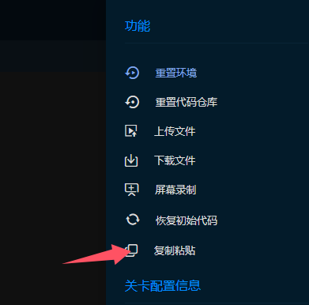
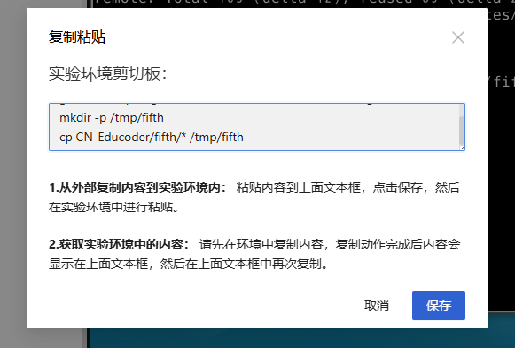
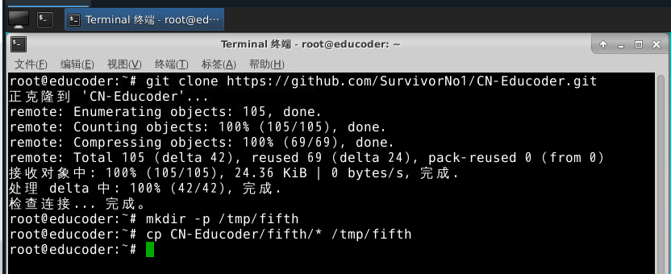

# CN-Educoder
## **仅供学习交流使用，侵权请联系删除**

高级算机网络 Educoder 课堂实验 TDUN

## 如何使用

- 实验环境可以访问互联网，只需按照以下步骤操作：

  对于网络协议分析实验，把要求的文件拷贝到要求的目录下，然后不断点击测评，下一关即可完成实验。

  例如，GNS3 组建小型局域网实验测试目录在/data/workspace/myshixun/first下（每个实验不一样），则创建目录，然后把对应的文件全部拷贝到该目录下.

  把下面的代码粘贴到环境的命令行中即可，粘贴方式如图。

```shell
git clone https://github.com/SurvivorNo1/CN-Educoder.git
mkdir -p /data/workspace/myshixun/first
cp CN-Educoder/first/* /data/workspace/myshixun/first/
```

​	不断点击测评，下一关即可完成实验.

​	对于其他实验，例如**DHCP 服务器配置**只需要替换命令中的`/data/workspace/myshixun/first`为`/tmp/fifth` , `CN-Educoder/first`为`CN-Educoder/fifth` ，不断点击测评，下一关即可完成实验.

- 具体的图文演示步骤，**DHCP 服务器配置**为例

  - 1
  - 2
  - 3
  - 4
  - 5

  

## 目录格式解释

**实验名** - repo 中答案所在文件夹，注意有的实验对应多个文件夹。

### 配置分析类实验

- **网络协议分析** - myshixun

  ```shell
  git clone https://github.com/SurvivorNo1/CN-Educoder.git
  cp CN-Educoder/myshixun/* /home/headless/Desktop/workspace/myshixun/
  ```

- **GNS3 组建小型局域网** - first

  ```shell
  git clone https://github.com/SurvivorNo1/CN-Educoder.git
  mkdir -p /data/workspace/myshixun/first
  cp CN-Educoder/first/* /data/workspace/myshixun/first/
  ```

- **静态路由配置** - second

  ```	
  git clone https://github.com/SurvivorNo1/CN-Educoder.git
  mkdir -p /tmp/second
  cp CN-Educoder/second/* /tmp/second
  ```

- **动态路由 RIP 与 OSPF 配置**
  
  - **动态路由 RIP 与 OSPF 配置 1-3 关** - third1-3
  - **动态路由 RIP 与 OSPF 配置 4 关** - third4
  - 特别的，动态路由 RIP 与 OSPF 配置实验，需要操作两次：
    ```bash
    git clone https://github.com/SurvivorNo1/CN-Educoder.git
    mkdir -p /tmp/third
    cp CN-Educoder/third1-3/* /tmp/third/
    ```
    点击3次测评，完成前3关，然后执行
    ```bash
    cp CN-Educoder/third4/* /tmp/third/
    ```
  
- **VLAN 间单臂路由配置** - fourth

  ```shell
  git clone https://github.com/SurvivorNo1/CN-Educoder.git
  mkdir -p /tmp/fourth
  cp CN-Educoder/fourth/* /tmp/fourth
  ```

- **DHCP 服务器配置** - fifth

  ```
  git clone https://github.com/SurvivorNo1/CN-Educoder.git
  mkdir -p /tmp/fifth
  cp CN-Educoder/fifth/* /tmp/fifth
  ```

### 代码类实验

对于代码类，只需将代码手动复制到目标位置即可。

- **WEB 服务器编程实现** - WEB 服务器编程实现

- **UDP Ping 程序实现** - UDP Ping 程序实现

- **基于 socket 的网络编程** - 基于 socket 的网络编程


---
